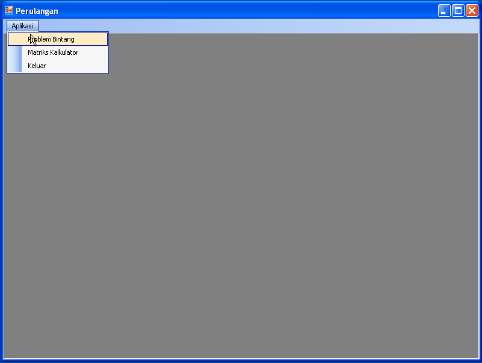

# Tugas Variabel, Tipe Data dan Percabangan

## WARNING-DISCLAIMER
Mohon baca petunjuk pengerjaan dengan seksama

## Soal
Buatlah sebuah aplikasi MDI yang mempunyai dua fitur utama, yaitu:

- Program Bintang
- Kalkulator Matriks Sederhana

Dokumentasikan alur program, dapat menggunakan flowchart atau pseudocode.
Sertakan juga narasi bagaimana jalannya alur aplikasi dalam format file PDF
dengan nama tugas-2015-03.pdf

Contoh hasil akhir aplikasi **Perulangan.exe**



## Petunjuk
- Untuk menampilkan form dalam aplikasi MDI, tambahkan baris kode ini pada Form
Utama
```vb
NamaForm.MdiParent = Me
NamaForm.Show()
```
- Gunakan fungsi split pada Object String, sebagai separator gunakan VbCrLf dan
karakter spasi
- Gunakan struktur data Nested List untuk melakukan perhitungan matriks. [Referensi](https://msdn.microsoft.com/en-us/library/6sh2ey19.aspx)
- Untuk membuat konfirmasi MessageBox gunakan return value dari fungsi Show yang
bertipe DialogResult
- Untuk keluar gunakan perintah
```vb
Environment.Exit(0)
```

## Cara Pengerjaan
- Buka file tugas-2015-03.sln dalam repositori ini **jangan membuat project baru!!!**, template project menggunakan Visual
  Studio 2010 (Silahkan gunakan menu upgrade jika anda menggunakan versi Visual
  Studio yang lebih baru)
- Ubah file [pernyataan.txt](./pernyataan.txt), isi dengan NIM, nama lengkap serta kelas.
- Kerjakan tugas sesuai dengan deskripsi soal.
- Deadline pengerjaan 17 Oktober 2015 23:59:59 WIB
- Lakukan commit sebelum deadline berakhir, kemudian lakukan sync ke repositori
  remote setelah waktu deadline
- Jika ada pertanyaan silahkan buat isu baru di [Repositori Tugas](https://github.com/polinema-gui/tugas)
